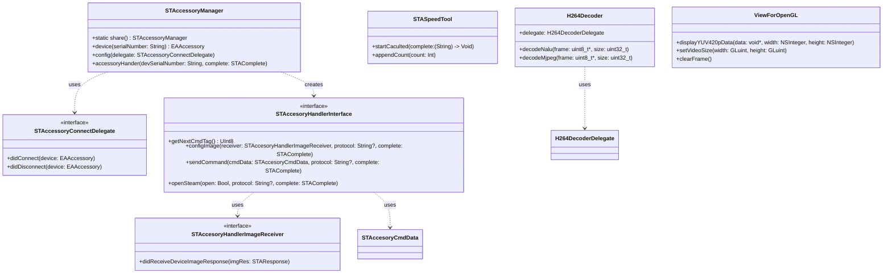
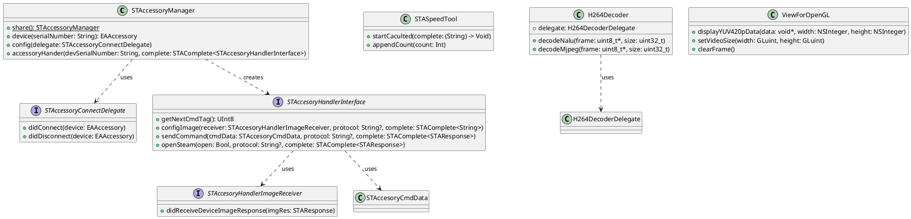
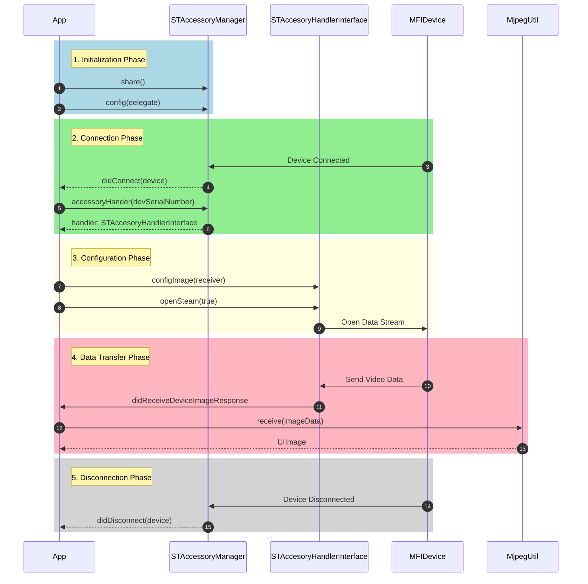
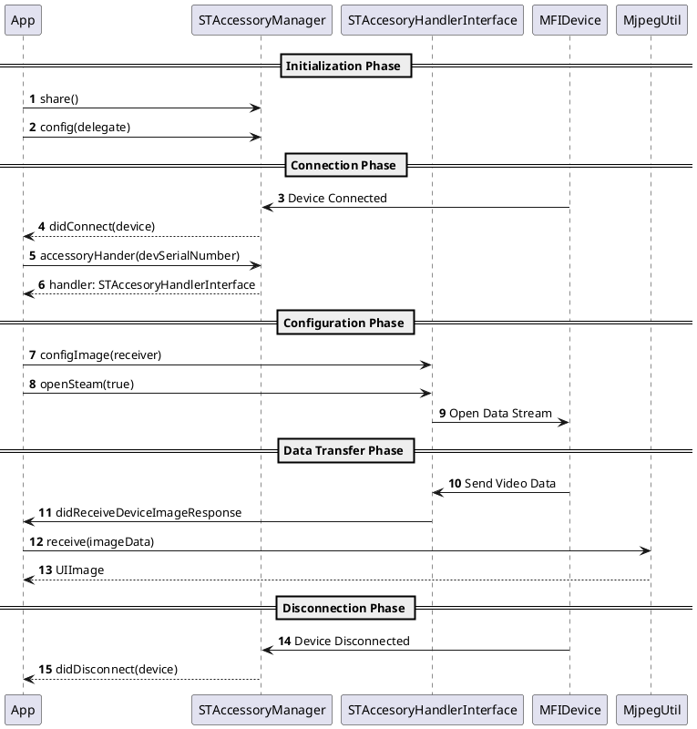

# STAccessoryManager

STAccessoryManager is an iOS SDK for managing and controlling MFi external devices, mainly used for device connection, data transmission and video stream processing.

[中文版](README.md)

## Table of Contents

- [STAccessoryManager](#staccessorymanager)
  - [Table of Contents](#table-of-contents)
  - [Architecture Design](#architecture-design)
    - [Class Diagram](#class-diagram)
      - [Mermaid](#mermaid)
      - [PlantUML](#plantuml)
    - [Sequence Diagram](#sequence-diagram)
      - [Mermaid](#mermaid-1)
      - [PlantUML](#plantuml-1)
  - [Main Features](#main-features)
  - [Core Classes and Protocols](#core-classes-and-protocols)
    - [Device Management](#device-management)
      - [STAccessoryManager](#staccessorymanager-1)
      - [STAccessoryConnectDelegate](#staccessoryconnectdelegate)
    - [Device Communication](#device-communication)
      - [STAccesoryHandlerInterface](#staccesoryhandlerinterface)
    - [Utility Classes](#utility-classes)
      - [STASpeedTool](#staspeedtool)
    - [Video Processing Classes](#video-processing-classes)
      - [H264Decoder](#h264decoder)
      - [ViewForOpenGL](#viewforopengl)
  - [Usage Examples](#usage-examples)
  - [Notes](#notes)
  - [Requirements](#requirements)
  - [Dependencies](#dependencies)
  - [Installation](#installation)
    - [CocoaPods](#cocoapods)
    - [Swift Package Manager](#swift-package-manager)

## Architecture Design

### Class Diagram

#### Mermaid


#### PlantUML


### Sequence Diagram

#### Mermaid


#### PlantUML


## Main Features

- MFi device connection and session management
- Device command sending and receiving
- Video stream processing (supports H264/MJPEG)
- Device configuration management

## Core Classes and Protocols

### Device Management

#### STAccessoryManager

Device management class, provides device connection and session management:

```swift
class STAccessoryManager {
    // Get singleton instance
    static func share() -> STAccessoryManager
    
    // Get specified device
    func device(_ serialNumber: String) -> EAAccessory?
    
    // Configure connection status listener
    func config(delegate: STAccessoryConnectDelegate)
    
    // Get device handler
    func accessoryHander(devSerialNumber: String, complete: STAComplete<STAccesoryHandlerInterface>?)
}
```

#### STAccessoryConnectDelegate

Device connection status listener:

```swift
protocol STAccessoryConnectDelegate {
    // Device connected
    func didConnect(device: EAAccessory)
    
    // Device disconnected
    func didDisconnect(device: EAAccessory) 
}
```

### Device Communication

#### STAccesoryHandlerInterface

Device handler interface, defines main methods for device interaction:

```swift
protocol STAccesoryHandlerInterface {
    // Get command tag
    func getNextCmdTag() -> UInt8
    
    // Configure image receiver
    func configImage(receiver: STAccesoryHandlerImageReceiver, 
                    protocol proStr: String?, 
                    complete: STAComplete<String>?)
    
    // Send command
    func sendCommand(_ cmdData: STAccesoryCmdData, 
                    protocol proStr: String?, 
                    complete: STAComplete<STAResponse>?)
    
    // Open/Close data stream
    func openSteam(_ open: Bool, 
                  protocol proStr: String?, 
                  complete: STAComplete<STAResponse>?)
}
```

### Utility Classes

#### STASpeedTool

Speed statistics utility:

```swift
class STASpeedTool {
    // Start statistics
    func startCaculted(_ complete: @escaping (_ speedDes: String) -> Void)
    
    // Add data count
    func appendCount(_ count: Int)
}
```

### Video Processing Classes

#### H264Decoder

H264 video decoder:

```objc
@interface H264Decoder : NSObject
@property (weak, nonatomic) id<H264DecoderDelegate> delegate;

// Decode H264 frame data
- (void)decodeNalu:(uint8_t *)frame withSize:(uint32_t)frameSize;

// Decode MJPEG frame data
- (void)decodeMjpeg:(uint8_t *)frame withSize:(uint32_t)frameSize;
@end
```

#### ViewForOpenGL

OpenGL video rendering view:

```objc
@interface ViewForOpenGL : UIView
// Display YUV data
- (void)displayYUV420pData:(void *)data width:(NSInteger)w height:(NSInteger)h;

// Set video size
- (void)setVideoSize:(GLuint)width height:(GLuint)height;

// Clear frame
- (void)clearFrame;
@end
```

## Usage Examples

1. Initialize and get device:

```swift
let manager = STAccessoryManager.share()
if let device = manager.device(serialNumber) {
    // Use device
}
```

2. Get command tag and send command:

```swift
// Get command tag
let cmdTag = handler.getNextCmdTag()

// Create command with tag
let cmd = STACommandserialization.setStreamFormatter(cmdTag)
let command = STAccesoryCmdData(tag: cmdTag, data: cmd)

// Send command
handler.sendCommand(command, protocol: nil) { response in
    if response.status {
        print("Command sent successfully")
    }
}
```

3. Configure video receiver:

```swift
handler.configImage(receiver: imageReceiver, protocol: nil) { result in
    if result.status {
        print("Configuration successful")
    }
}
```

4. Open data stream:

```swift
let cmdData = STACommandserialization.openStreamCmd(withTag: tag, open: 0x01)
handler.sendCommand(cmdData, protocol: nil) { response in
    if response.status {
        print("Command sent successfully")
    }
}
```

5. Receive image data:

```swift
// Implement STAccesoryHandlerImageReceiver protocol
class YourClass: STAccesoryHandlerImageReceiver {
    func didReceiveDeviceImageResponse(_ imgRes: STAResponse) {
        guard let imgData = imgRes.imageData, imgData.count > 0 else { return }
        
        // Process MJPEG data
        let mjpegUtil = MjpegUtil()
        mjpegUtil.receive(imgData) { (image: UIImage) in
            // Display image
            self.imageView.image = image
        }
        
        // Or process H264 data
        let h264Decoder = H264Decoder()
        h264Decoder.delegate = self
        h264Decoder.decodeNalu(imgData.bytes, withSize: UInt32(imgData.count))
    }
}

// H264 decode callback
extension YourClass: H264DecoderDelegate {
    func decoder(_ decoder: H264Decoder, didOutput frame: CVPixelBuffer) {
        // Process decoded frame
        glView.displayYUV420pData(frame, width: width, height: height)
    }
}
```

6. Video rendering:

```swift
class STVideoView: UIView {
    private lazy var glView: ViewForOpenGL = {
        let view = ViewForOpenGL()
        view.backgroundColor = .black
        return view
    }()
    
    private var hasSetVideoSize = false
    private var videoWidth: Int = 0
    private var videoHeight: Int = 0
    private lazy var h264Decoder: H264Decoder = {
        let decoder = H264Decoder()
        decoder.delegate = self
        return decoder
    }()
    
    override init(frame: CGRect) {
        super.init(frame: frame)
        setupUI()
    }
    
    required init?(coder: NSCoder) {
        super.init(coder: coder)
        setupUI()
    }
    
    private func setupUI() {
        addSubview(glView)
        glView.snp.makeConstraints { make in
            make.center.equalToSuperview()
            // 16:9 aspect ratio
            make.width.equalTo(self.snp.width)
            make.height.equalTo(glView.snp.width).multipliedBy(9.0/16.0)
        }
    }
    
    func setVideoSize(width: Int, height: Int) {
        videoWidth = width
        videoHeight = height
        glView.setVideoSize(UInt32(width), height: UInt32(height))
    }
}

// Implement image receiving and rendering
extension STVideoView: STAccesoryHandlerImageReceiver {
    func didReceiveDeviceImageResponse(_ imgRes: STAResponse) {
        guard let imgData = imgRes.imageData, imgData.count > 0 else { return }
        
        // Decode and display
        h264Decoder.decodeNalu(imgData.bytes, withSize: UInt32(imgData.count))
    }
}

extension STVideoView: H264DecoderDelegate {
    func decoder(_ decoder: H264Decoder, didOutput frame: CVPixelBuffer) {
        // Update UI on main thread
        DispatchQueue.main.async {
            self.glView.displayYUV420pData(frame, width: self.videoWidth, height: self.videoHeight)
        }
    }
}
```

7. Display image using UIImageView:

```swift
class STImageView: UIView {
    private lazy var imageView: UIImageView = {
        let view = UIImageView()
        view.backgroundColor = .black
        view.contentMode = .scaleAspectFit
        return view
    }()
    
    private lazy var mjpegUtil = MjpegUtil()
    
    override init(frame: CGRect) {
        super.init(frame: frame)
        setupUI()
    }
    
    required init?(coder: NSCoder) {
        super.init(coder: coder)
        setupUI()
    }
    
    private func setupUI() {
        addSubview(imageView)
        imageView.snp.makeConstraints { make in
            make.center.equalToSuperview()
            // 16:9 aspect ratio
            make.width.equalTo(self.snp.width)
            make.height.equalTo(imageView.snp.width).multipliedBy(9.0/16.0)
        }
    }
}

// Implement image receiving and display
extension STImageView: STAccesoryHandlerImageReceiver {
    func didReceiveDeviceImageResponse(_ imgRes: STAResponse) {
        guard let imgData = imgRes.imageData, imgData.count > 0 else { return }
        
        // Process MJPEG data
        mjpegUtil.receive(imgData) { [weak self] (image: UIImage) in
            // Update UI on main thread
            DispatchQueue.main.async {
                self?.imageView.image = image
            }
        }
    }
}
```

## Notes

1. All device interaction operations should be executed in the correct queue
2. Pay attention to memory management when processing video data
3. Close video stream and release resources when not needed
4. Video rendering uses OpenGL, pay attention to context management

## Requirements

- iOS 11.0+
- Xcode 12.0+

## Dependencies

- ExternalAccessory.framework
- OpenGLES.framework
- VideoToolbox.framework
- AVFoundation.framework

## Installation

### CocoaPods

```ruby
pod 'STAccessoryManager', :git => 'https://github.com/STTechnology5652/STAccessoryManager.git', :tag => '0.0.1'
```

### Swift Package Manager

```swift
dependencies: [
    .package(url: "https://github.com/STTechnology5652/STAccessoryManager.git", .upToNextMajor(from: "0.0.1"))
]
``` 